# Extension Design: Identity Reconciler — Scale Architecture (HLD)

## Overview

This document describes how the POC Identity Reconciler scales to handle 200GB+ datasets and streaming workloads. Each section presents multiple approaches with tradeoffs, diagrams, and a recommended path.

This is a **design-only deliverable** — no code is built for this scope.

> For POC design (LLD), see [LLD.md](./LLD.md).

---

## POC → Extension Component Mapping

| POC Component | Extension Service | Key Change |
|---------------|------------------|------------|
| REST Controller (sync) | Job API + Query API | Async job submission |
| Normalizer (in-memory) | Normalizer Worker Fleet (ECS) | Reads from S3, writes to DynamoDB |
| Blocking Engine (HashMap) | LSH + OpenSearch | Distributed blocking index |
| Field Comparator (in-process loop) | Comparator Workers (ECS + SQS) | Pull pairs from queue |
| Scoring Engine (in-memory) | Embedded in Comparator Workers | Same interface, same logic |
| Explanation Builder (in-memory) | Embedded in Comparator Workers | Same interface, same logic |

---

## 1. Data Ingestion

**Problem:** The POC accepts records via a single synchronous REST call (max 10K records). At scale, we need to ingest 200GB+ datasets efficiently.

### Approach A: Batch File Upload (S3 + Trigger) ✓ PROPOSED

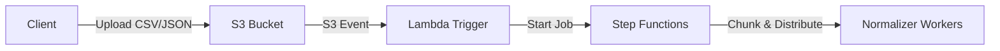

### Approach B: Streaming Ingestion (Kinesis)

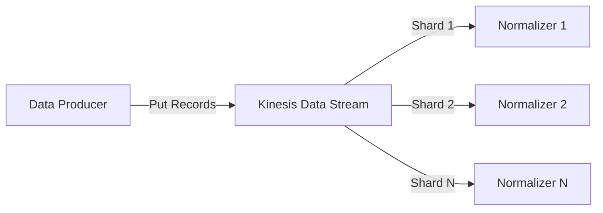

### Approach C: Hybrid (Batch + Streaming)

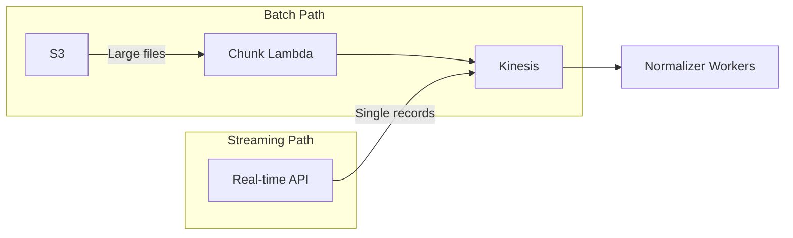

### Tradeoffs

| Criteria | A: Batch File (S3) | B: Streaming (Kinesis) | C: Hybrid |
|----------|-------------------|----------------------|-----------|
| Complexity | Low | Medium | High |
| Latency | Minutes (batch) | Seconds (per-record) | Both |
| Cost (200GB) | Low (S3 + Lambda) | Medium (Kinesis shards 24/7) | High |
| Backpressure | Natural (file-based) | Requires shard tuning | Mixed |
| Retry/replay | Easy (re-process file) | Kinesis retention window | Mixed |
| POC interface change | Minimal (add upload endpoint) | New producer SDK needed | Both |

**Recommendation: Approach A.** Simplest path from POC, matches the use case (reconcile two datasets = two files), low cost, easy retry. Streaming added later if real-time matching is needed.

---

## 2. Distributed Blocking

**Problem:** The POC uses in-memory HashMaps for blocking. At 200GB+, blocking keys and record groups don't fit in a single process.

### Approach A: Locality-Sensitive Hashing (LSH) + OpenSearch ✓ PROPOSED

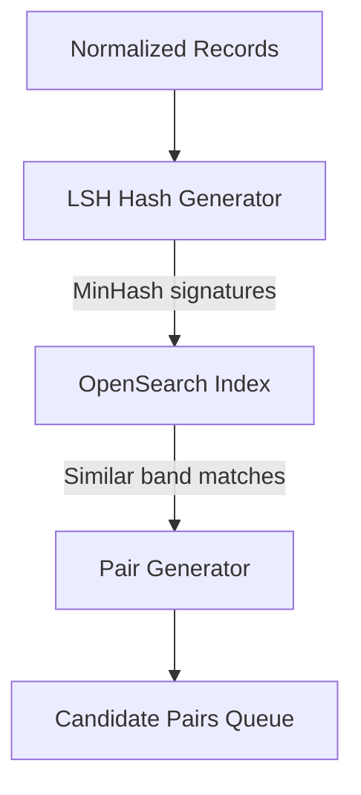

### Approach B: Sorted Neighborhood on Partitioned Data

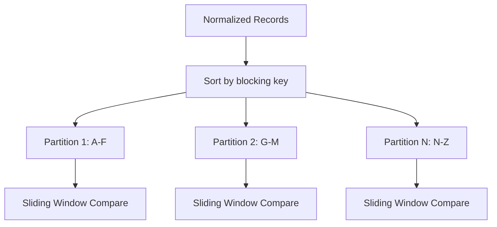

### Approach C: Database-Backed Blocking (DynamoDB GSI)

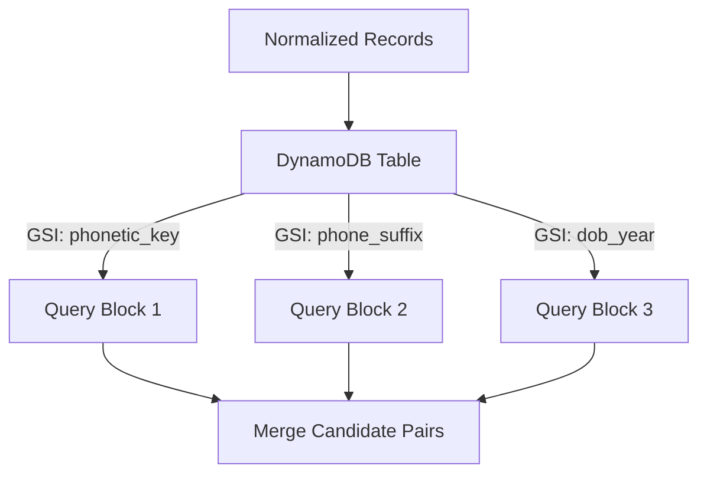

### Tradeoffs

| Criteria | A: LSH + OpenSearch | B: Sorted Neighborhood | C: DynamoDB GSI |
|----------|--------------------|-----------------------|-----------------|
| Recall (true match rate) | High (tunable bands/rows) | Medium (fixed window) | Medium (exact key only) |
| Scalability | Excellent (horizontal) | Good (embarrassingly parallel) | Good (auto-scales) |
| Complexity | Medium (LSH tuning) | Low (sort + window) | Low (GSI queries) |
| Fuzzy matching | Native | Limited (key ordering) | None (exact keys) |
| Cost | Medium (OpenSearch cluster) | Low (compute only) | Medium (RCU/WCU) |
| Trestle stack fit | Strong (already using OpenSearch) | N/A | Partial |

**Recommendation: Approach A.** LSH provides tunable precision/recall tradeoff and supports fuzzy blocking — important for messy identity data. OpenSearch is already in Trestle's stack.

---

## 3. Parallel Matching

**Problem:** The POC compares pairs sequentially. At scale, millions of candidate pairs need parallel comparison.

### Approach A: SQS Worker Fleet ✓ PROPOSED

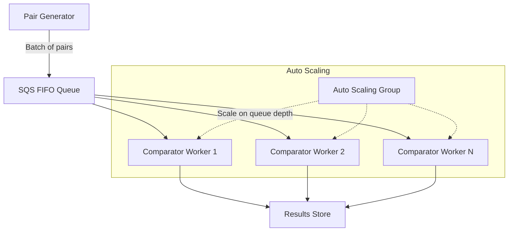

### Approach B: EMR / MapReduce

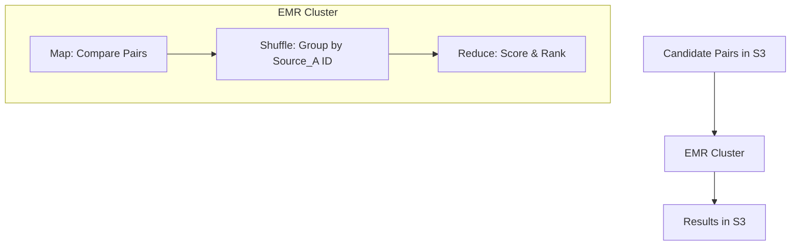

### Approach C: Step Functions + Lambda Fan-Out

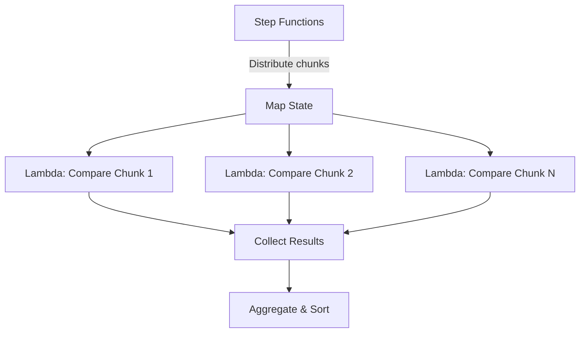

### Tradeoffs

| Criteria | A: SQS Workers | B: EMR / MapReduce | C: Step Functions + Lambda |
|----------|---------------|-------------------|---------------------------|
| Latency | Low (continuous) | High (cluster startup) | Medium (cold starts) |
| Scalability | Excellent (auto-scaling) | Excellent (add nodes) | Good (1000 concurrent) |
| Cost model | Pay per message + compute | Per-hour cluster | Pay per invocation |
| Complexity | Low (standard pattern) | Medium (EMR config) | Low (serverless) |
| Failure handling | Built-in DLQ | Task-level retry | Built-in retry + catch |
| Idle cost | Zero (scale to 0) | Non-zero (min cluster) | Zero |

**Recommendation: Approach A.** Proven pattern, auto-scales on queue depth, zero idle cost, built-in DLQ. Workers run the same `FieldComparator` + `ScoringEngine` interfaces from the POC.

---

## 4. Storage & State

**Problem:** The POC holds everything in memory. At scale, we need persistent storage for normalized records, blocking indices, and results.

### Approach A: DynamoDB ✓ PROPOSED

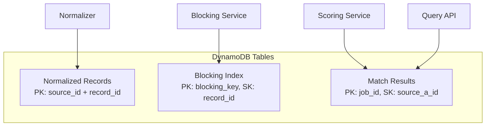

### Approach B: RDS (PostgreSQL)

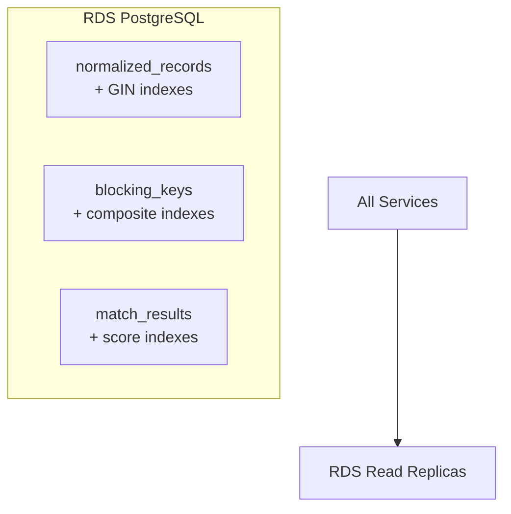

### Approach C: Redis Cluster (Hot) + S3 (Cold)

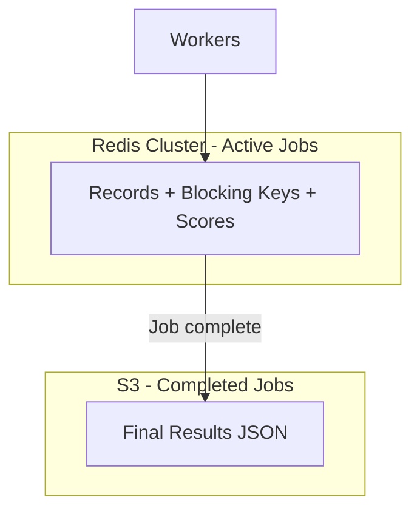

### Tradeoffs

| Criteria | A: DynamoDB | B: RDS (PostgreSQL) | C: Redis + S3 |
|----------|------------|--------------------|--------------| 
| Scalability | Excellent (auto) | Limited (vertical) | Excellent (sharding) |
| Query flexibility | Limited (key-based) | High (SQL, joins) | Limited (key-value) |
| Cost at 200GB | Medium (on-demand) | High (always-on) | High (RAM-priced) |
| Operational burden | Low (serverless) | Medium (patching) | Medium (cluster mgmt) |
| Latency | Single-digit ms | Low ms | Sub-ms |
| Durability | High (replicated) | High (Multi-AZ) | Low (volatile) |

**Recommendation: Approach A.** Serverless, scales without intervention, pay-per-use fits batch workloads. Key-access pattern matches our use case (lookup by blocking key, lookup by job ID).

---

## 5. Result Delivery

**Problem:** The POC returns results synchronously. At scale, processing takes minutes-to-hours.

### Approach A: Async Job + Polling API ✓ PROPOSED

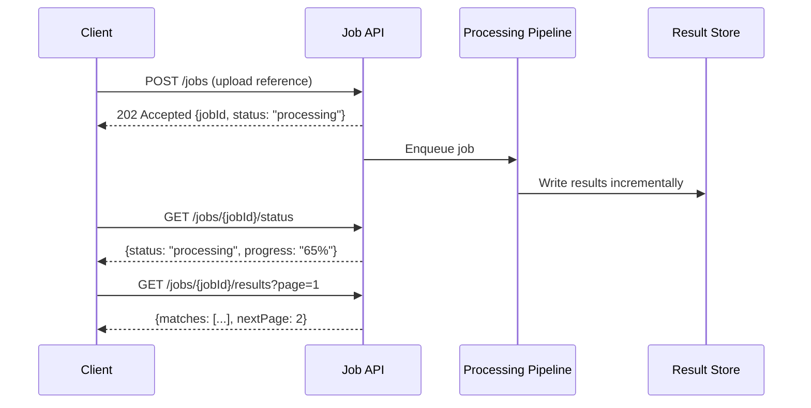

### Approach B: Webhook Callback

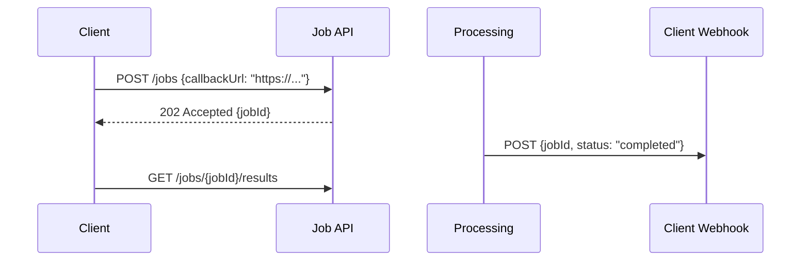

### Approach C: S3 Result File + SNS Notification

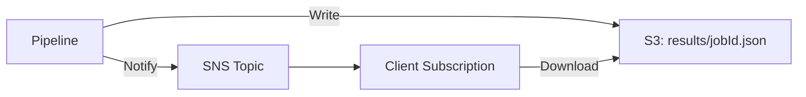

### Tradeoffs

| Criteria | A: Polling API | B: Webhook | C: S3 + SNS |
|----------|---------------|-----------|-------------|
| Client complexity | Low (GET calls) | Medium (host endpoint) | Medium (SNS sub) |
| Real-time push | No (interval) | Yes | Yes |
| Reliability | High (client retries) | Medium (delivery issues) | High (S3 durable) |
| Large results | Good (paginated) | Poor (payload limits) | Good (file download) |
| Firewall friendly | Excellent (outbound) | Poor (inbound) | Good |

**Recommendation: Approach A.** Simplest for clients, paginated results handle large output, progress tracking built-in. Webhook can be added later as optional notification layer.

---

## Composed Extension Architecture

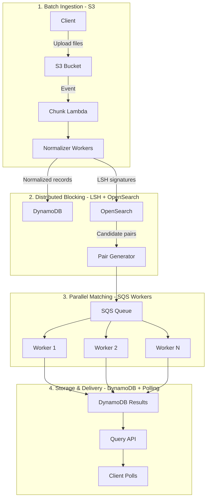

---

## Operational Concerns

| Concern | Approach |
|---------|----------|
| Service discovery | AWS ECS Service Connect (or ALB for HTTP) |
| Retry policy | SQS visibility timeout + DLQ after 3 retries |
| Circuit breaker | Resilience4j on OpenSearch calls |
| Observability | X-Ray distributed tracing + CloudWatch metrics |
| Backpressure | SQS queue depth triggers auto-scaling; S3 upload rate naturally bounded |
| Cost optimization | DynamoDB on-demand (pay per request), ECS Fargate Spot for workers |
