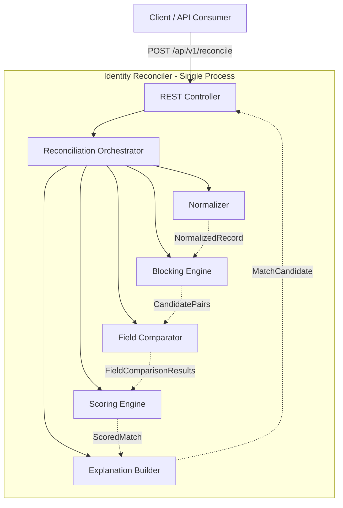
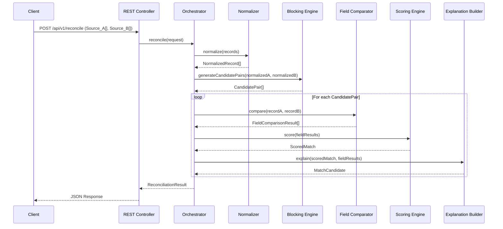
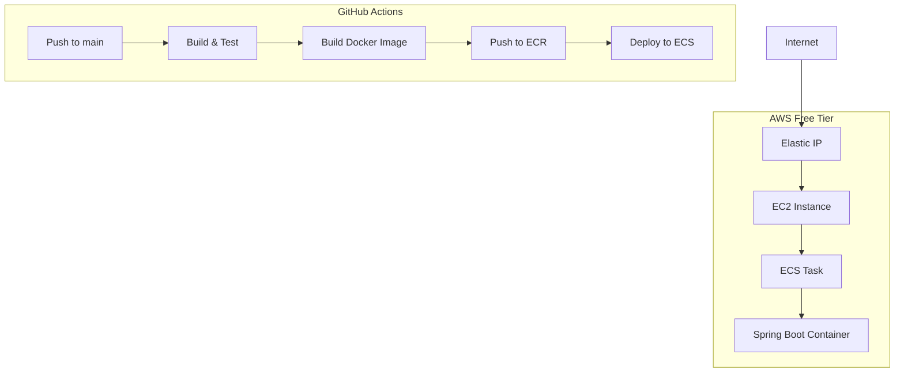
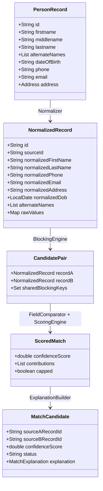

# Design Document: Identity Reconciler — POC

## Overview

The Identity Reconciler is a record linkage service that identifies matching person records between two data sources containing messy, inconsistent identity data. It produces confidence-scored match candidates with human-readable explanations.

The POC is a single-process, in-memory Java Spring Boot service deployed on AWS ECS free tier, handling datasets up to 10,000 records per source. Internal components have clean interfaces and module boundaries, making each component extractable as an independent service.

> For scale architecture (200GB+ / streaming), see [HLD.md](./HLD.md).

### Design Approach

**Interface-Driven Component Architecture** — Each component behind a Java interface, wired via Spring DI, communicating via DTOs. This satisfies the component boundary requirement, provides a clear mapping to the scale design, and is idiomatic Spring Boot.

---

## Architecture

### System Architecture



### Request Flow



### Component Responsibilities

| Component | Responsibility | Input | Output |
|-----------|---------------|-------|--------|
| REST Controller | Request validation, error responses | HTTP Request | HTTP Response |
| Orchestrator | Pipeline coordination | ReconciliationRequest | ReconciliationResult |
| Normalizer | Field canonicalization | PersonRecord | NormalizedRecord |
| Blocking Engine | Candidate pair reduction | NormalizedRecord[] × 2 | CandidatePair[] |
| Field Comparator | Per-field similarity | NormalizedRecord × 2 | FieldComparisonResult |
| Scoring Engine | Weighted aggregation | FieldComparisonResult | ScoredMatch |
| Explanation Builder | Human-readable output | ScoredMatch | MatchExplanation |

### Deployment Architecture



---

## Components and Interfaces

### Person Record Model (aligned with Trestle Find Person API)

The input `PersonRecord` is modeled after Trestle's [Find Person API](https://docs.trestleiq.com/api-reference-archived/find-person-api) person object, with address as a structured sub-object:

```java
public record PersonRecord(
    String id,                        // unique identifier within source
    @Nullable String firstname,       // Trestle field: "firstname"
    @Nullable String middlename,      // Trestle field: "middlename"
    @Nullable String lastname,        // Trestle field: "lastname"
    @Nullable List<String> alternateNames,  // Trestle field: "alternate_names"
    @Nullable String dateOfBirth,     // multiple formats accepted
    @Nullable String phone,           // E.164 or local format
    @Nullable String email,
    @Nullable Address address         // structured address (Trestle Location format)
) {}

public record Address(
    @Nullable String streetLine1,     // Trestle: "street_line_1"
    @Nullable String streetLine2,     // Trestle: "street_line_2"
    @Nullable String city,
    @Nullable String stateCode,       // Trestle: "state_code"
    @Nullable String postalCode,      // Trestle: "postal_code"
    @Nullable String countryCode      // Trestle: "country_code" (ISO-3166)
) {}
```

### Component 1: Normalizer

**Interface:**

```java
package reconciler.normalizer;

public interface Normalizer {
    NormalizationResult normalize(PersonRecord record);
    List<NormalizationResult> normalizeBatch(List<PersonRecord> records);
}
```

**DTOs:**

```java
public record NormalizationResult(
    NormalizedRecord normalizedRecord,
    List<NormalizationWarning> warnings
) {}

public record NormalizationWarning(
    String fieldName,
    String originalValue,
    String reason
) {}

public record NormalizedRecord(
    String id,
    String sourceId,
    String normalizedFirstName,
    String normalizedLastName,
    String normalizedPhone,       // digits only with country code
    String normalizedEmail,       // lowercase, plus-addressing removed
    String normalizedAddress,     // full canonical address string
    LocalDate normalizedDob,      // ISO 8601
    List<String> alternateNames,  // preserved for matching
    Map<String, String> rawValues // original values for explanation
) {}
```

**Normalization Strategies:**

| Field | Strategy |
|-------|----------|
| Name | Lowercase, collapse whitespace, trim, retain hyphens/apostrophes, remove periods, nickname resolution via dictionary |
| Phone | Strip non-digits, prepend "1" if 10 digits |
| Email | Lowercase, remove "+" and everything after it before "@" |
| Address | Concatenate structured fields, lowercase, expand USPS abbreviations (St→Street, Ave→Avenue, etc.), collapse whitespace |
| DOB | Parse multiple formats → ISO 8601 (YYYY-MM-DD) |

### Component 2: Field Comparator

**Interface:**

```java
package reconciler.comparator;

public interface FieldComparator {
    FieldComparisonResult compare(NormalizedRecord recordA, NormalizedRecord recordB);
}

public interface FieldSimilarityStrategy {
    double computeSimilarity(String valueA, String valueB);
    String describeComparison(String valueA, String valueB);
}
```

**DTOs:**

```java
public record FieldComparisonResult(
    List<FieldScore> fieldScores,
    List<String> missingFields
) {}

public record FieldScore(
    String fieldName,
    double similarity,
    String rawValueA,
    String rawValueB,
    String normalizedValueA,
    String normalizedValueB,
    String comparisonMethod,
    boolean present
) {}
```

**Similarity Algorithms:**

| Field | Primary Algorithm | Fallback | Rationale |
|-------|------------------|----------|-----------|
| Name (first/last) | Jaro-Winkler (threshold 0.85) | Nickname lookup → Soundex | Handles typos + phonetic variants |
| Phone | Exact match on normalized digits | Last-7 suffix match | High-entropy; partial = different |
| Email | Exact match on normalized form | Levenshtein on local part | Plus-addressing handled by normalizer |
| Address | Token-based Jaccard similarity | Levenshtein on street portion | Variable ordering, optional components |
| DOB | Exact match on date | Partial match (2-of-3 components) | Transposition errors common |

**Name Comparison (inspired by Trestle's 13 match types):**

```java
public class NameSimilarityStrategy implements FieldSimilarityStrategy {
    // Match types (ordered by strength):
    // 1. Exact match after normalization → 1.0
    // 2. Nickname resolution (Bill=William) → 0.95
    // 3. Phonetic match (Soundex/Metaphone) → 0.85
    // 4. Jaro-Winkler ≥ 0.85 → JW score
    // 5. Swapped first/last detection → 0.90
    // 6. Initial match (J Smith = John Smith) → 0.80
    // 7. Alternate names match (from alternate_names list) → 0.90
    // 8. Partial match (one name component matches) → 0.5-0.7
}
```

### Component 3: Blocking Engine

**Interface:**

```java
package reconciler.blocking;

public interface BlockingEngine {
    BlockingResult generateCandidatePairs(
        List<NormalizedRecord> sourceA, 
        List<NormalizedRecord> sourceB
    );
}

public interface BlockingKeyGenerator {
    Set<String> generateKeys(NormalizedRecord record);
}
```

**DTOs:**

```java
public record BlockingResult(
    List<CandidatePair> candidatePairs,
    BlockingStatistics statistics
) {}

public record CandidatePair(
    NormalizedRecord recordA,
    NormalizedRecord recordB,
    Set<String> sharedBlockingKeys
) {}

public record BlockingStatistics(
    int totalBlocks,
    double averageBlockSize,
    int maxBlockSize,
    long comparisonsPerformed,
    long exhaustiveCount,
    double reductionPercentage
) {}
```

**Blocking Key Strategies (at least 2 independent keys per Req 6.2):**

| Strategy | Key Generation | Example |
|----------|---------------|---------|
| Phonetic Last Name | Soundex(normalizedLastName) | "Smith" → "S530" |
| Phone Suffix | Last 4 digits of normalized phone | "12065551234" → "1234" |
| DOB Year | Year component of DOB | "1990-05-15" → "1990" |
| First Name Initial + DOB Month | first char + DOB month | "John" + "05" → "J05" |

- **Block Size Cap:** Max 100 records from one source per block. Exceeded → split using secondary key.
- **Fallback Block:** Records missing all blocking key fields → compared against all opposing records.

### Component 4: Scoring Engine

**Interface:**

```java
package reconciler.scoring;

public interface ScoringEngine {
    ScoredMatch score(FieldComparisonResult fieldResult, ScoringConfig config);
}
```

**DTOs:**

```java
public record ScoredMatch(
    double confidenceScore,
    List<FieldContribution> contributions,
    boolean capped,
    String cappingReason
) {}

public record FieldContribution(
    String fieldName,
    double weight,
    double similarity,
    double contribution
) {}

public record ScoringConfig(
    Map<String, Double> fieldWeights,
    double matchThreshold,
    double reviewBandLowerBound,
    double conflictCapThreshold
) {}
```

**Default Weights (high-entropy ≥ 60% per Req 3.2):**

| Field | Weight | Category |
|-------|--------|----------|
| Phone | 0.25 | High-entropy |
| Email | 0.20 | High-entropy |
| DOB | 0.20 | High-entropy |
| First Name | 0.10 | Low-entropy |
| Last Name | 0.15 | Low-entropy |
| Address | 0.10 | Low-entropy |
| **Total** | **1.00** | High-entropy: 65% |

**Scoring Algorithm (pseudocode):**

```
function score(fieldResults, config):
    presentFields = fieldResults.filter(f -> f.present)
    totalWeight = sum(config.weights[f.name] for f in presentFields)
    
    // Redistribute weights proportionally among present fields
    adjustedWeights = {}
    for field in presentFields:
        adjustedWeights[field.name] = config.weights[field.name] / totalWeight
    
    // Compute raw score
    rawScore = sum(adjustedWeights[f.name] * f.similarity for f in presentFields)
    
    // Conflict cap: 1 high-entropy ≥ 0.8 AND another field < 0.3 → cap at 0.6
    highEntropyHits = presentFields.filter(f -> isHighEntropy(f) && f.similarity >= 0.8)
    conflictingFields = presentFields.filter(f -> f.similarity < 0.3)
    if highEntropyHits.size() == 1 && conflictingFields.size() >= 1:
        rawScore = min(rawScore, 0.6)
        capped = true
    
    return round(rawScore, 2)
```

### Component 5: Explanation Builder

**Interface:**

```java
package reconciler.explanation;

public interface ExplanationBuilder {
    MatchExplanation buildExplanation(
        ScoredMatch scoredMatch,
        FieldComparisonResult fieldResult,
        NormalizedRecord normalizedA,
        NormalizedRecord normalizedB
    );
}
```

**DTOs:**

```java
public record MatchExplanation(
    String summary,
    List<FieldBreakdown> fieldBreakdowns,
    double totalScore,
    boolean ambiguous,
    List<String> ambiguityReasons
) {}

public record FieldBreakdown(
    String fieldName,
    String rawValueA,
    String rawValueB,
    String normalizationApplied,
    String similarityMethod,
    double similarityResult,
    double scoreContribution,
    boolean present
) {}
```

**Summary Generation:**
- High confidence (≥0.8): "Strong match: [top 2 fields] agree with high similarity."
- Review band (0.4-0.7): "Ambiguous match: [agreeing fields] support, but [conflicting fields] differ."
- Low confidence (<0.4): "Weak match: limited agreement across fields."

### Orchestrator

```java
package reconciler.orchestrator;

public interface ReconciliationOrchestrator {
    ReconciliationResult reconcile(ReconciliationRequest request);
}
```

## Data Models

### API Data Models

**Request:**

```java
public record ReconciliationRequest(
    List<PersonRecord> sourceA,       // 1-10,000 records
    List<PersonRecord> sourceB,       // 1-10,000 records
    @Nullable ThresholdConfig thresholds
) {}

public record ThresholdConfig(
    @Nullable Double matchThreshold,        // default 0.7
    @Nullable Double reviewBandLowerBound   // default 0.4
) {}
```

**Response:**

```java
public record ReconciliationResponse(
    String jobId,
    ResponseMetadata metadata,
    List<MatchCandidate> matches
) {}

public record ResponseMetadata(
    int sourceACount,
    int sourceBCount,
    int matchesFound,
    int flaggedForReview,
    long processingDurationMs
) {}

public record MatchCandidate(
    String sourceARecordId,
    String sourceBRecordId,
    double confidenceScore,
    String status,           // "match", "review", "ambiguous"
    boolean requiresReview,
    MatchExplanation explanation
) {}
```

### Data Flow Diagram


