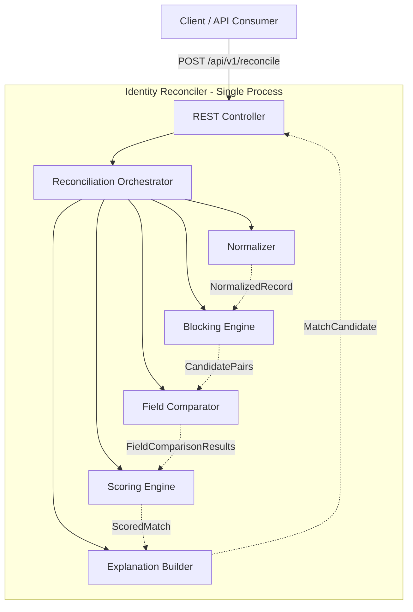
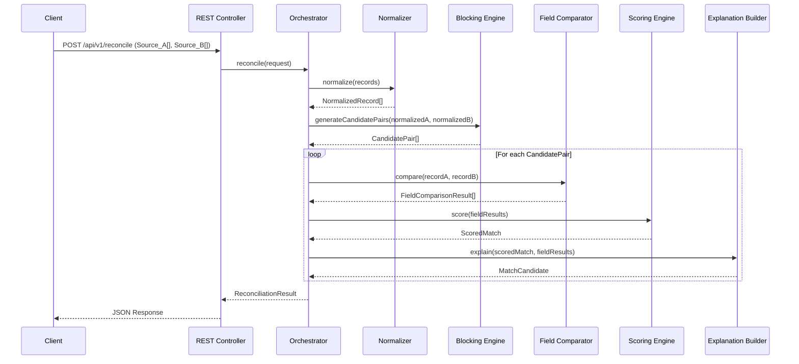
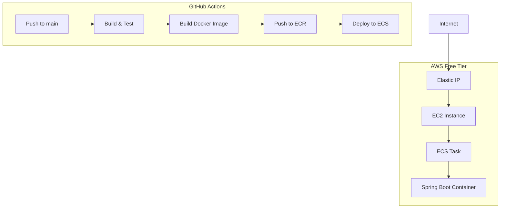

# Identity Reconciler

A record linkage service that identifies matching person records between two data sources containing messy, inconsistent identity data. It produces confidence-scored match candidates with human-readable explanations of why each match was proposed.

The service is a single-process, in-memory Java Spring Boot application deployed on AWS ECS free tier, handling datasets up to 10,000 records per source. Internal components have clean interfaces and module boundaries, making each component extractable as an independent service.

**Live URL:** http://40.192.4.151:8080/ui/input

---

## Development

### Prerequisites

- Java 21 (Eclipse Temurin recommended)
- Gradle 8+ (wrapper included)
- Docker (optional, for containerized runs)

### Run with Gradle

```bash
# Build and run tests
./gradlew build

# Start the application
./gradlew bootRun
```

The service starts at `http://localhost:8080`.

### Run with Docker

```bash
# Build the Docker image
docker build -t identity-reconciler .

# Run the container
docker run -p 8080:8080 identity-reconciler
```


---

## Architecture

## Links:
- API DOC: [APIDOC.md](./APIDOC.md)
- LLD DOC: [LLD.md](./LLD.md)
- HLD DOC: [HLD.md](./HLD.md)
- AI USAGE APPENDIX: [AI_USAGE_APPENDIX.md](./AI_USAGE_APPENDIX.md)

### System Architecture



### Request Flow



### Component Responsibilities

| Component | Responsibility | Input | Output |
|-----------|---------------|-------|--------|
| REST Controller | Request validation, error responses | HTTP Request | HTTP Response |
| Orchestrator | Pipeline coordination | ReconciliationRequest | ReconciliationResult |
| Normalizer | Field canonicalization | PersonRecord | NormalizedRecord |
| Blocking Engine | Candidate pair reduction | NormalizedRecord[] × 2 | CandidatePair[] |
| Field Comparator | Per-field similarity | NormalizedRecord × 2 | FieldComparisonResult |
| Scoring Engine | Weighted aggregation | FieldComparisonResult | ScoredMatch |
| Explanation Builder | Human-readable output | ScoredMatch | MatchExplanation |

### Request Flow

```
Client → REST Controller → Orchestrator
  → Normalizer (canonicalize all records)
  → Blocking Engine (reduce comparison space)
  → Field Comparator (compute per-field similarity for each candidate pair)
  → Scoring Engine (weighted aggregation → confidence score)
  → Explanation Builder (human-readable explanation)
  → Response with scored, explained match candidates
```

---

## Configuration

### Thresholds

| Parameter | Default | Description |
|-----------|---------|-------------|
| `matchThreshold` | 0.7 | Score at or above this = positive match |
| `reviewBandLowerBound` | 0.4 | Score in [0.4, 0.7) = flagged for review; below 0.4 = excluded |

Thresholds can be overridden per-request via the `thresholds` object in the request body.

### Field Weights

High-entropy identifiers collectively contribute 65% of the score:

| Field | Weight | Category |
|-------|--------|----------|
| Phone | 0.25 | High-entropy |
| Email | 0.20 | High-entropy |
| Date of Birth | 0.20 | High-entropy |
| First Name | 0.10 | Low-entropy |
| Last Name | 0.15 | Low-entropy |
| Address | 0.10 | Low-entropy |

When fields are missing, weights are redistributed proportionally among present fields.

### Conflict Cap

If exactly one high-entropy field scores ≥ 0.8 but at least one other field scores < 0.3, the confidence score is capped at 0.6 and the conflicting fields are flagged in the explanation.

---

## Deployment

### Infrastructure

- **Compute:** AWS ECS on EC2 (free tier eligible)
- **Networking:** Elastic IP for a stable public endpoint
- **Container Registry:** Amazon ECR
- **Region:** ap-south-2 (Hyderabad)

### CI/CD Pipeline (GitHub Actions)

On every push to `main`:
1. **Build & Test** — Compiles with Java 21, runs the full test suite (unit + property-based + integration)
2. **Deploy** — Builds Docker image → pushes to ECR → updates ECS task definition → deploys with service stability wait

Deployment is blocked if any test fails.

### Deployment Diagram

```
Push to main
  → GitHub Actions: Build & Test (./gradlew build)
  → Build Docker image
  → Push to Amazon ECR
  → Update ECS task definition
  → Deploy to ECS service (waits for stability)
  → Service reachable at Elastic IP :8080
```

### Deployment Architecture



---

## Design Decisions

### Interface-Driven Architecture

Every core component (Normalizer, FieldComparator, BlockingEngine, ScoringEngine, ExplanationBuilder) is defined behind a Java interface. Implementations are wired via Spring dependency injection. This means:
- Any component can be swapped without modifying calling code
- DTOs between components are transport-agnostic (serializable for future network transport)
- The POC maps directly to a distributed architecture where each interface becomes a service boundary

### Blocking for Performance

Instead of exhaustive O(n×m) pairwise comparison, the blocking engine groups records using multiple independent keys (phonetic last name, phone suffix, DOB year, first initial + DOB month). For datasets > 1,000 records per source, this reduces comparisons to < 10% of the exhaustive count.

### Conflict Cap

A single high-entropy field match with contradicting data elsewhere doesn't produce a false-positive. The scoring engine caps such cases at 0.6 and flags them for human review.

### Explanation-First Matching

Every match candidate includes a structured explanation showing:
- Per-field raw values, normalized forms, similarity method, and score contribution
- Sum of contributions equals the confidence score (auditable)
- Ambiguous cases are explicitly flagged with reasons

### Package Structure

```
com.prashanthganojiatwork.reconciler/
├── api/             # REST controller, web controller, DTOs, exception handling
├── orchestrator/    # Pipeline coordination
├── normalizer/      # Field canonicalization strategies
├── comparator/      # Per-field similarity strategies
├── blocking/        # Candidate pair reduction, blocking key generators
├── scoring/         # Weighted aggregation, conflict cap logic
├── explanation/     # Human-readable explanation builder
├── model/           # Shared data models (PersonRecord, Address, etc.)
└── config/          # Spring configuration, scoring weights
```

No circular dependencies between packages. Each component is independently testable through its interface.

---

### Tech Stack

| Technology | Purpose |
|-----------|---------|
| Java 21 | Language runtime |
| Spring Boot 4.1 | Application framework |
| Thymeleaf | Server-side UI templates |
| Apache Commons Text | String similarity (Jaro-Winkler) |
| Commons Codec | Phonetic encoding (Soundex/Metaphone) |
| Jackson | JSON serialization |
| jqwik | Property-based testing |
| ArchUnit | Architecture rule enforcement |
| Docker | Containerization |
| GitHub Actions | CI/CD |